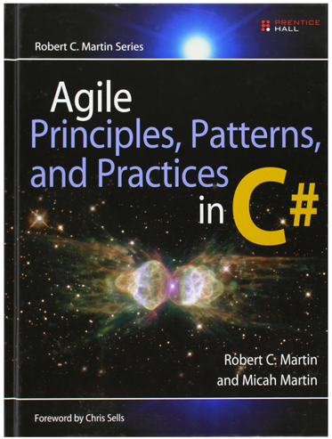
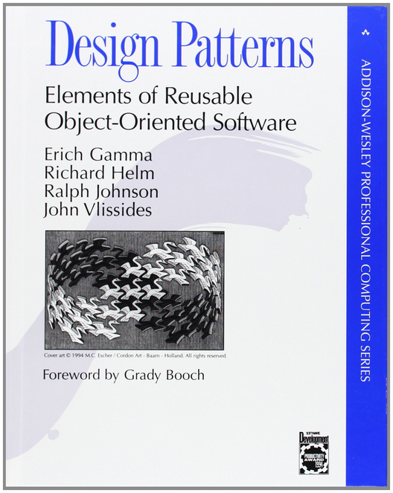
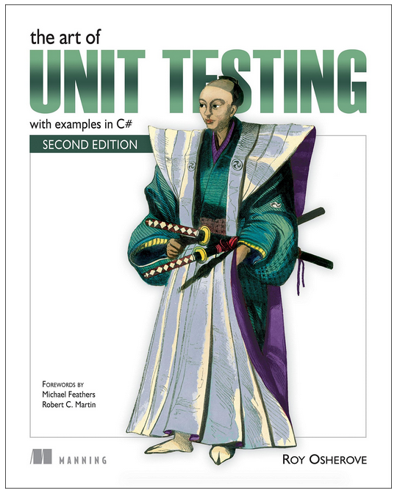

# Introduction to the C# language and .NET Platform
## Language basics, syntax, instalation and introduction to Visual Studio

[ Michal Orlicek <xorlic00@stud.fit.vutbr.cz> ]

---
#Syllabus of lectures:
//todo

+++
#Syllabus of laboratories
//todo

---
#Literature to study
##C# 7.0 in a Nutshell: The Definitive Reference

ISBN 9781491987650

+++
Recommended literature

    
    ISBN 9780131857254

    
    ISBN 9780132350884

+++
Recommended literature

    
    ISBN 9780201633610

    
    ISBN 9781617290893

